## 示例
[](http://bgods.cn/)


## 说明

本站是基于的Hexo博客主题 [Material X](https://xaoxuu.com/projects/#Material-X) ，使用 Python3.6.3+Django3.0.7编写，后台集成富文本编辑器 [django-ckeditor](https://github.com/django-ckeditor/django-ckeditor)，代码高亮使用 [Prism](https://prismjs.com/download.html#themes=prism-okaidia&languages=markup+css+clike+javascript)插件，可选择自己喜欢的样式，替换静态文件中的highlight\prism.css文件即可。
有疑问，或者建议可到[我的博客](http://bgods.cn/)下留言。

## 1、页面


- 侧边栏有

侧边栏有个人卡片、、广告位、友情链接、热门标签、音乐插件，可在默认配置文件及后台管理修改相关设置。

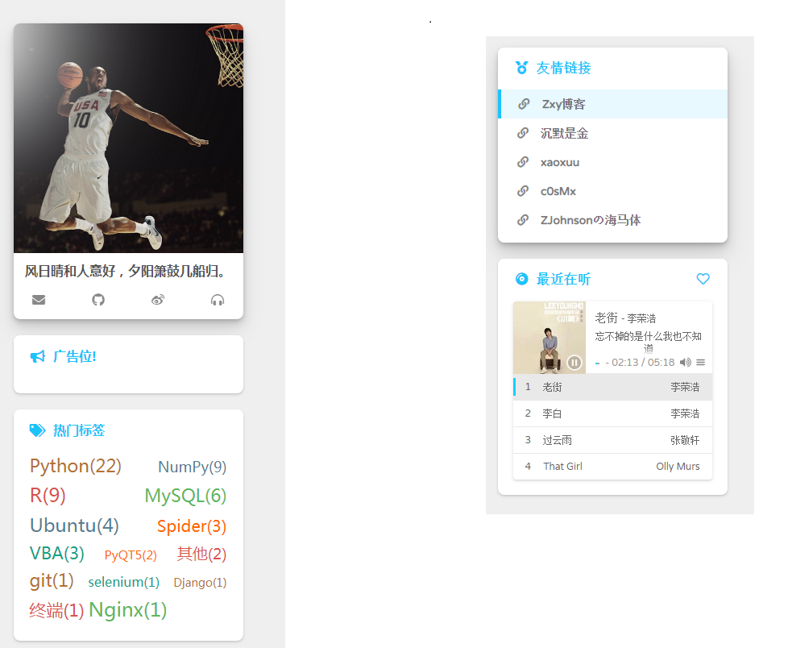

- 主页

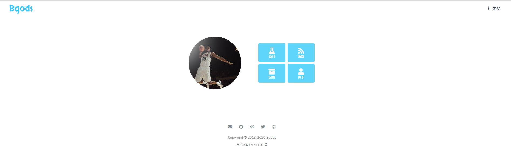

- 博客列表页

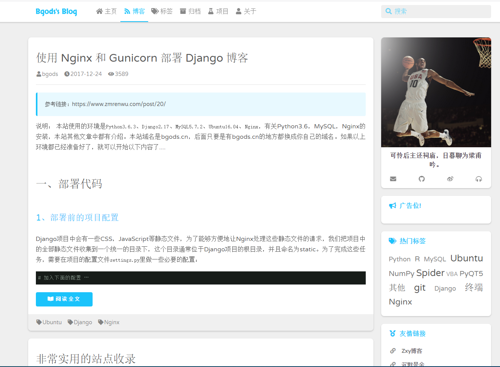

- 归档

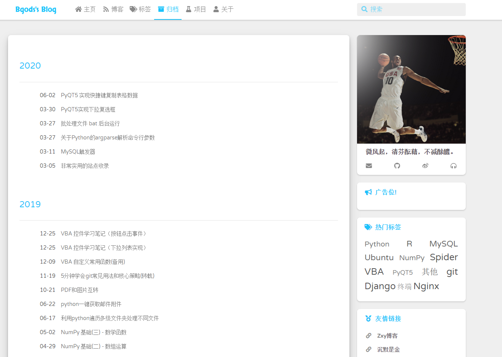

- 标签

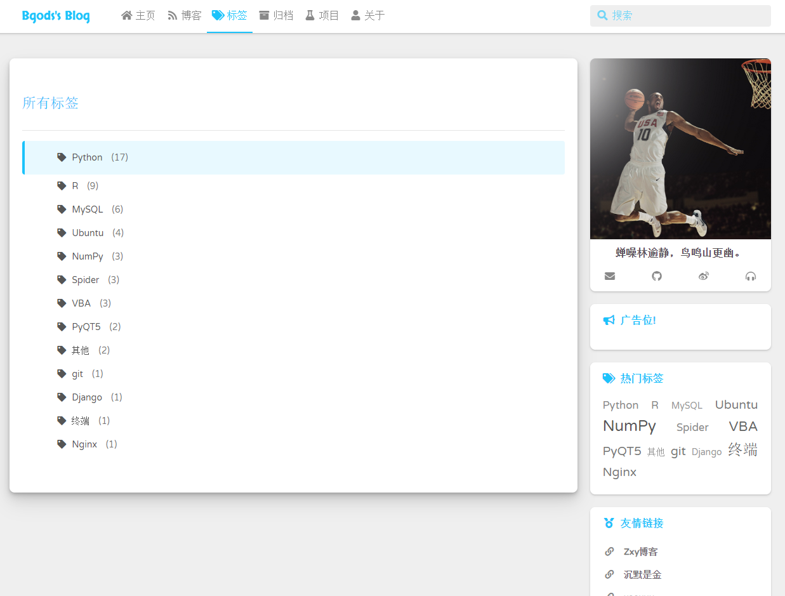

- 博客正文

博客正文支持代码高亮，支持显示文章目录。

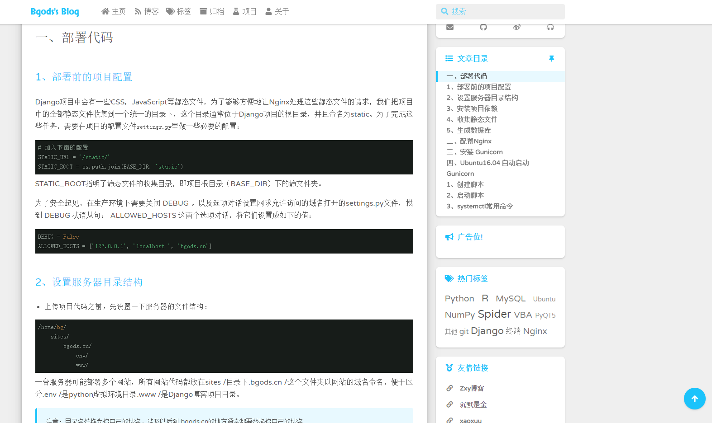

- 评论

评论区支持富文本编辑器 [django-ckeditor](https://github.com/django-ckeditor/django-ckeditor)，评论支持邮箱通知

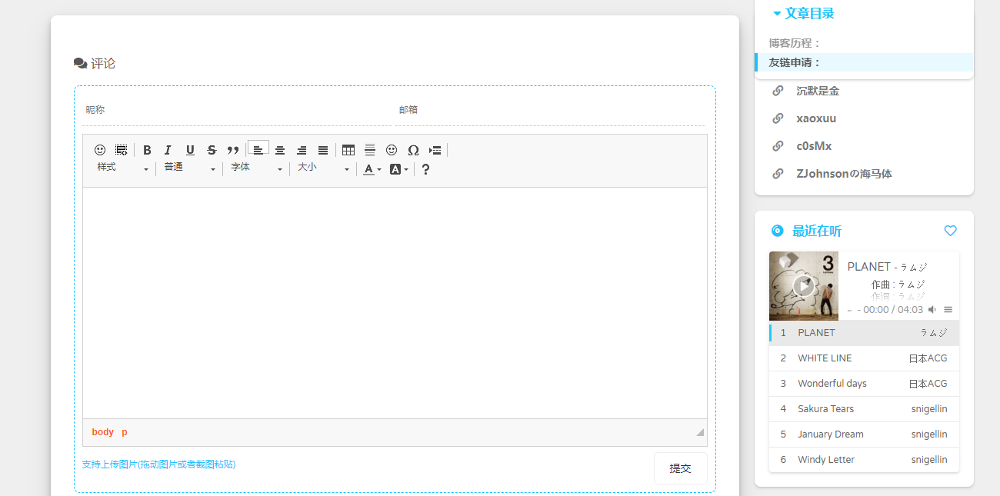


## 2、后台管理


- 编辑器

后台集成富文本编辑器 [django-ckeditor](https://github.com/django-ckeditor/django-ckeditor)

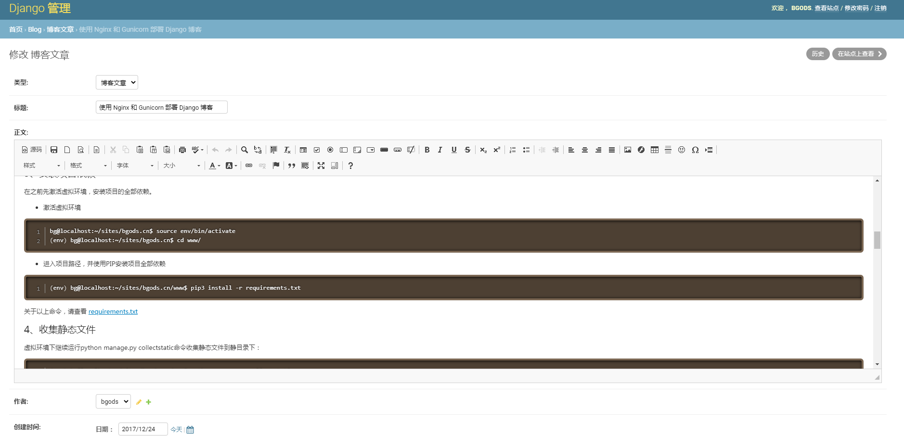

- 后台管理主页

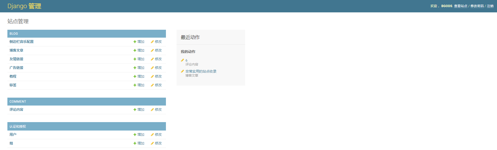

- 博客文章管理

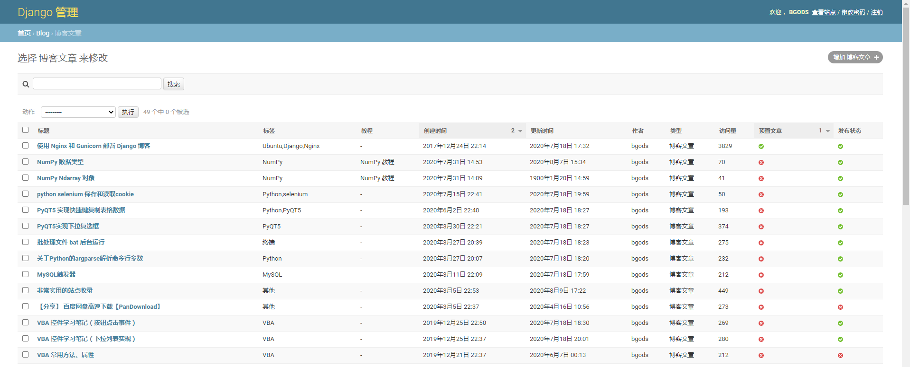

- 友情链接管理

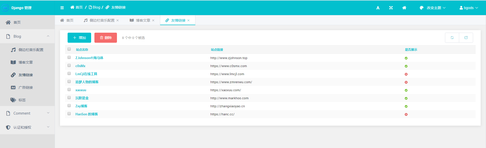

- 音乐插件管理

支持虾米音乐、QQ音乐、酷狗音乐、网易云音乐。注意设置多个时，只有一个是有效，因此可以将其他设置为不启用，只需要启用一个即可。

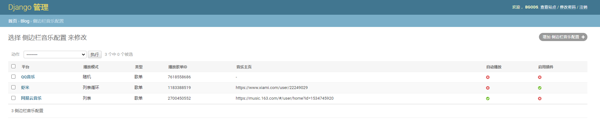

- 评论管理

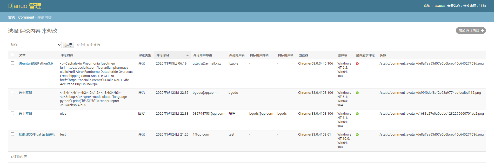

---

## 使用方法

### 1、下载源代码到本地

1. 使用git命令下载
```bash
git clone https://github.com/Bgods/Django-blog-material-x.git
```
2. 或者点击[下载到本地](https://github.com/Bgods/Django-blog-material-x/archive/master.zip)

### 2、修改配置

修改 www/www/settings.py 文件
```python
#  邮箱配置
EMAIL_USE_SSL = True
EMAIL_HOST = 'smtp.163.com'  # 我这里使用的是163邮箱，可以配置其他
EMAIL_PORT = 465
EMAIL_HOST_USER = 'bgods_blog@163.com'  # 邮箱帐号：用于发送邮件的账号
EMAIL_HOST_PASSWORD = '******'        # 邮箱密码：用于发送邮件的账号密码
DEFAULT_FROM_EMAIL = 'bgods_blog <bgods_blog@163.com>'   # 发件人，邮件头部显示

EMAIL_RECEIVE_LIST = [
    'bgods@qq.com',
]  # 接收邮件帐号列表(可写多个)： 有评论时候，通知哪些邮箱，可以是发件邮箱或者其他
```
当然, 还有其他配置, 比如后台管理以及评论内容编辑器的配置, 具体自己可以百度调整

### 3、安装依赖

- 进入项目目录创建虚拟环境，安装依赖
```bash
cd Desktop/www # 进入项目目录
virtualenv venv # 创建虚拟环境
source venv/bin/activate # 激活虚拟环境
pip install -r requirements.txt # 安装依赖
```
[](doc/install-packages.png)

### 4、收集静态文件

```bash
python manage.py collectstatic
```

### 5、创建数据库

```bash
python manage.py makemigrations
python manage.py migrate
```
[](doc/create-database.png)

### 6、创建超级管理员账号

```bash
python manage.py createsuperuser
```
依次输入用户名，邮箱，密码

[](doc/create-admin-user.png)

### 7、运行
```bash
python manage.py runserver 127.0.0.1:9000
```
运行上面代码，本地访问 127.0.0.1:9000 就能看到你的站点了。

### 8、其他问题


- 静态文件：

路径 www/static 下存放的js、css、font，以及站点的logo等图片，logo等图片可以替换自己的；


