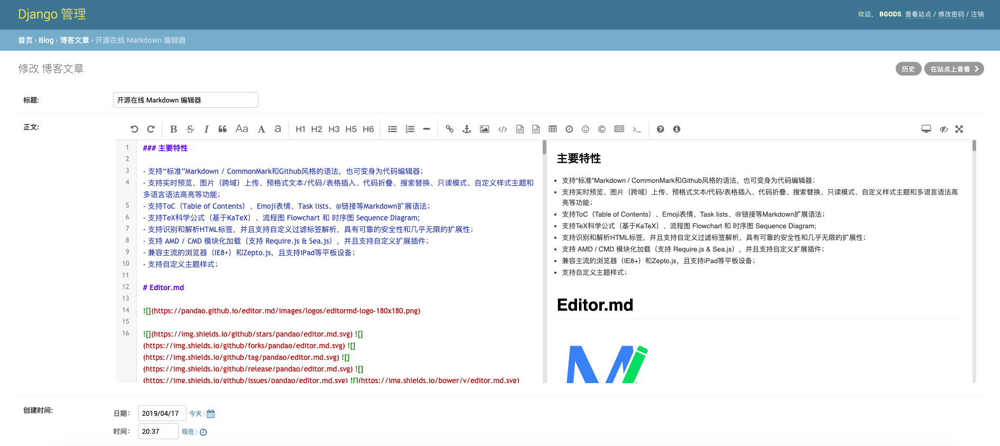
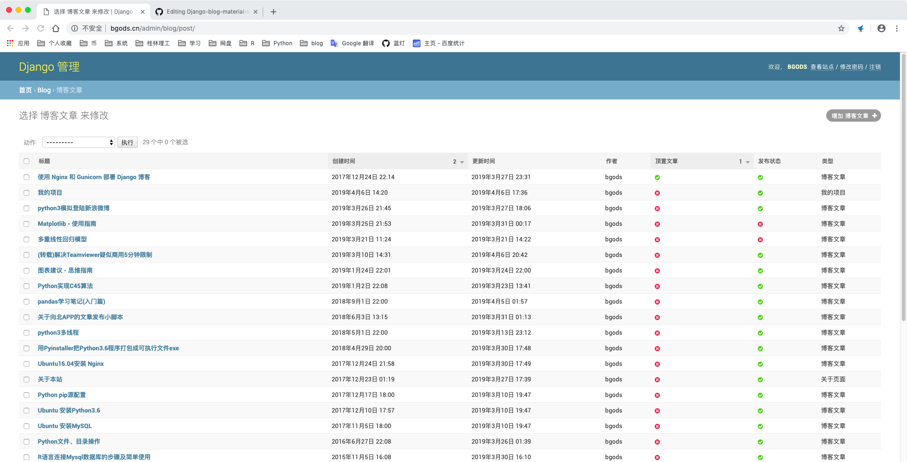
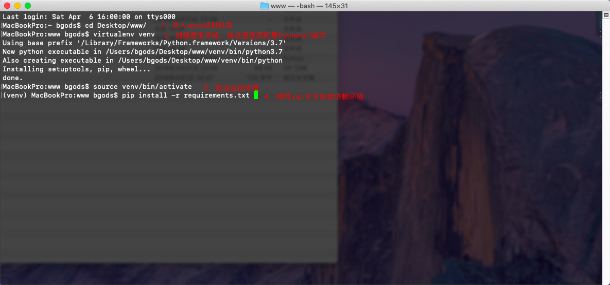
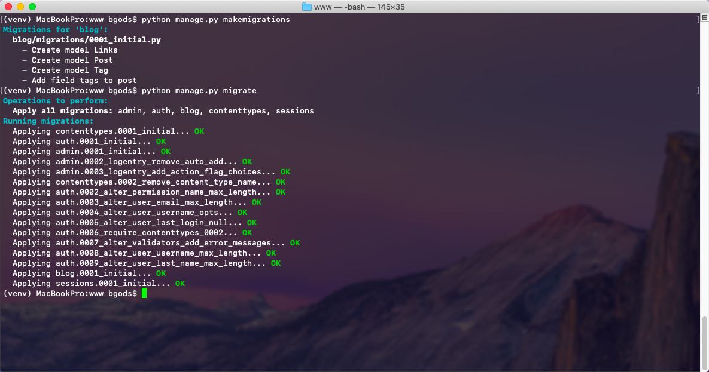
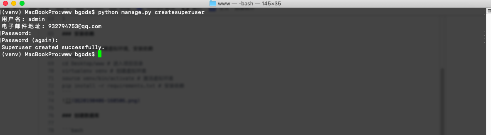

## 示例
[](http://bgods.cn/)


## 说明

本站是基于的Hexo博客主题 [Material X](https://xaoxuu.com/projects/#Material-X) ，改用 Python3.6.3+Django2.17编写的；
后台集成Markdown编辑器 [mdeditor](https://pandao.github.io/editor.md/)，前端代码高亮使用的是highlight.js插件。

[](doc/admin-post-add.png)
[](doc/admin-post-view.png)


## 使用方法

由于本博客使用Python3.6.3+Django2.17编写，为了避免出现问题，建议使用相同配置环境，使用虚拟环境，这里以本地环境为例。
有任何疑问，或建议可以到[我的博客](http://bgods.cn/)下留言

### 1、下载源代码到本地

1. 使用git命令下载
```bash
git clone https://github.com/Bgods/Django-blog-material-x.git
```
2. 或者点击[下载到本地](https://github.com/Bgods/Django-blog-material-x/archive/master.zip)

### 2、修改配置

修改 www/www/settings.py 文件
```python
# 站点配置
SITE_CONFIGS = {
    'Name': 'Bgods', # 站点名称
    'Title': '人生苦短,我用Python', # 站点标题

    # 站点底部footer配置，请改为自己的，不需要的选项可以留空
    'Footer': {
        'Email': 'bgods@qq.com', # 邮箱
        'Weibo': 'http://weibo.com/songzhilian22', # 新浪微博
        'Music': 'https://music.163.com/#/user/home?id=1534745920', # 音乐地址
        'Twitter': 'http://blog.csdn.net/songzhilian22', # Twitter
        'GitHub': 'https://github.com/Bgods', # GitHub
        'Beian': '粤ICP备17050010号', # 备案号
    },

    # 侧边栏音乐插件配置
    'Music': {
        'enable': 'true',      # 是否启用：true/false
        'home': 'https://music.163.com/#/user/home?id=1534745920', # 用户主页，点击会跳转到你的主页
        'server': 'netease',   # netease（网易云音乐）tencent（QQ音乐） xiami（虾米） kugou（酷狗）
        'mode': 'circulation', # random （随机） single （单曲） circulation （列表循环） order （列表）
        'type': 'playlist',    # song （单曲） album （专辑） playlist （歌单） search （搜索）
        'id': '2700450552', # 播放歌单id，获取方法自行百度。比如我的网易云的歌单id就是链接后面的id，https://music.163.com/#/playlist?id=2700450552
        'autoplay': 'false', #是否自动播放：true/false

    # 第三方评论Gitalk插件配置，不需要评论的可以留空，关于下面的参数获取自己百度：(参考链接:https://www.jianshu.com/p/78c64d07124d)
    'Gitalk': {
        'clientID': '你的clientID', # Github Application clientID
        'clientSecret': '你的clientSecret', # Github Application clientSecret
        'repo': 'Github 仓库名', # 存储你评论 issue 的 Github 仓库名
        'owner': 'Github 用户名', # Github 用户名
        'admin': 'Github 用户名', # Github 用户名
    },

    # 百度统计代码，获取方法自行百度,不需要的话可以留空
    'BaiduTj': '''
    <script>
    var _hmt = _hmt || [];
    (function() {
        var hm = document.createElement("script");
        hm.src = "https://hm.baidu.com/hm.js?你的ID";
        var s = document.getElementsByTagName("script")[0];
        s.parentNode.insertBefore(hm, s);
    })();
    </script>''',
}
```
### 3、安装依赖

- 进入项目目录创建虚拟环境，安装依赖
```bash
cd Desktop/www # 进入项目目录
virtualenv venv # 创建虚拟环境
source venv/bin/activate # 激活虚拟环境
pip install -r requirements.txt # 安装依赖
```
[](doc/install-packages.png)

### 4、创建数据库

```bash
python manage.py makemigrations
python manage.py migrate
```
[](doc/create-database.png)

### 5、创建超级管理员账号

```bash
python manage.py createsuperuser
```
依次输入用户名，邮箱，密码
[](doc/create-admin-user.png)

### 6、运行
```bash
python manage.py runserver 127.0.0.1:9000
```
运行上面代码，本地访问 127.0.0.1:9000 就能看到你的站点了。

### 7、其他问题


- 代码高亮：

代码配色都放在 **www/static/highlight/styles** 下，默认使用atelier-savanna-dark.css；
需要更换不同配色的请修改templates/blog/base.html模板
```html
<!-- 代码高亮插件 -->
<link rel="stylesheet" href="">
```
配色参考：[https://highlightjs.org/static/demo/](https://highlightjs.org/static/demo/)

- 静态文件：

路径 www/static 下存放的js、css、font，以及站点的logo等图片，logo等图片可以替换自己的；


