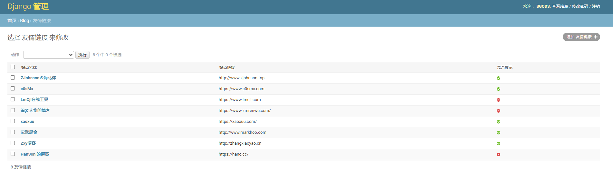

## 示例
[](http://bgods.cn/)


## 说明

本站是基于的Hexo博客主题 [Material X](https://xaoxuu.com/projects/#Material-X) ，使用 Python3.6.3+Django3.0.7编写，后台集成Markdown编辑器 [mdeditor](https://pandao.github.io/editor.md/)，前端代码高亮使用的是highlight.js插件。
有疑问，或者建议可到[我的博客](http://bgods.cn/)下留言。

## 1、页面


- 侧边栏有

侧边栏有个人卡片、、广告位、友情链接、热门标签、音乐插件，可在默认配置文件及后台管理修改相关设置。


- 主页


- 博客列表页


- 归档


- 标签


- 博客正文

博客正文支持代码高亮，支持显示文章目录。


- 评论

评论区支持 Markdown 语法，评论支持邮箱通知


## 2、后台管理

使用[simpleui](https://github.com/newpanjing/simpleui)第三方后台管理工具，特色如下：

- 编辑器

后台集成Markdown编辑器 [mdeditor](https://pandao.github.io/editor.md/)，


- 后台管理主页


- 博客文章管理


- 友情链接管理



- 音乐插件管理

支持虾米音乐、QQ音乐、酷狗音乐、网易云音乐。注意设置多个时，只有一个是有效，因此可以将其他设置为不启用，只需要启用一个即可。


- 评论管理


## 使用方法

### 1、下载源代码到本地

1. 使用git命令下载
```bash
git clone https://github.com/Bgods/Django-blog-material-x.git
```
2. 或者点击[下载到本地](https://github.com/Bgods/Django-blog-material-x/archive/master.zip)

### 2、修改配置

修改 www/www/settings.py 文件
```python
# 站点配置
SITE_CONFIGS = {
    'Name': 'Bgods', # 站点名称
    'Title': '人生苦短,我用Python', # 站点标题

    # 站点底部footer配置
    'Footer': {
        'Email': 'bgods@qq.com', # 邮箱
        'Weibo': 'http://weibo.com/songzhilian22', # 新浪微博
        'Music': 'https://music.163.com/#/user/home?id=1534745920', # 音乐地址
        'Twitter': 'http://blog.csdn.net/songzhilian22', # Twitter
        'GitHub': 'https://github.com/Bgods', # GitHub
        'Beian': '粤ICP备17050010号', # 备案号
    },


    # 百度统计,代码获取方法自行百度,不需要的话可以留空
    'BaiduTj': '''
    <script>
    var _hmt = _hmt || [];
    (function() {
        var hm = document.createElement("script");
        hm.src = "https://hm.baidu.com/hm.js?你的ID";
        var s = document.getElementsByTagName("script")[0];
        s.parentNode.insertBefore(hm, s);
    })();
    </script>''',
}

#  邮箱配置
EMAIL_USE_SSL = True
EMAIL_HOST = 'smtp.163.com'  # 我这里使用的是163邮箱，可以配置其他QQ等
EMAIL_PORT = 465
EMAIL_HOST_USER = 'bgods_blog@163.com'  # 邮箱帐号
EMAIL_HOST_PASSWORD = '******'  # 邮箱密码
DEFAULT_FROM_EMAIL = 'bgods_blog <bgods_blog@163.com>'   # 发件人，邮件头部显示
HTTP_HOST = 'http://bgods.cn'  # 正式部署时站点域名，用于评论回复发送邮件时，收件人从邮件中的跳转到评论区。我这里是http://bgods.cn

```
### 3、安装依赖

- 进入项目目录创建虚拟环境，安装依赖
```bash
cd Desktop/www # 进入项目目录
virtualenv venv # 创建虚拟环境
source venv/bin/activate # 激活虚拟环境
pip install -r requirements.txt # 安装依赖
```
[](doc/install-packages.png)

### 4、收集静态文件

```bash
python manage.py collectstatic
```

### 5、创建数据库

```bash
python manage.py makemigrations
python manage.py migrate
```
[](doc/create-database.png)

### 6、创建超级管理员账号

```bash
python manage.py createsuperuser
```
依次输入用户名，邮箱，密码

[](doc/create-admin-user.png)

### 7、运行
```bash
python manage.py runserver 127.0.0.1:9000
```
运行上面代码，本地访问 127.0.0.1:9000 就能看到你的站点了。

### 8、其他问题


- 代码高亮：

代码配色都放在 **www/static/highlight/styles** 下，默认使用atelier-savanna-dark.css；
需要更换不同配色的请修改templates/blog/base.html模板
```html
<!-- 代码高亮插件 -->
<link rel="stylesheet" href="">
```
配色参考：[https://highlightjs.org/static/demo/](https://highlightjs.org/static/demo/)

- 静态文件：

路径 www/static 下存放的js、css、font，以及站点的logo等图片，logo等图片可以替换自己的；


